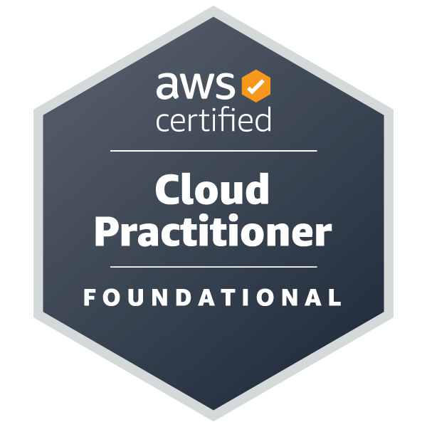
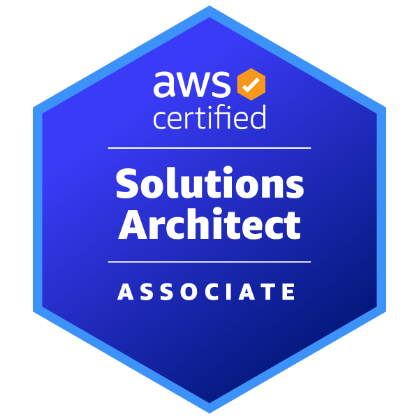
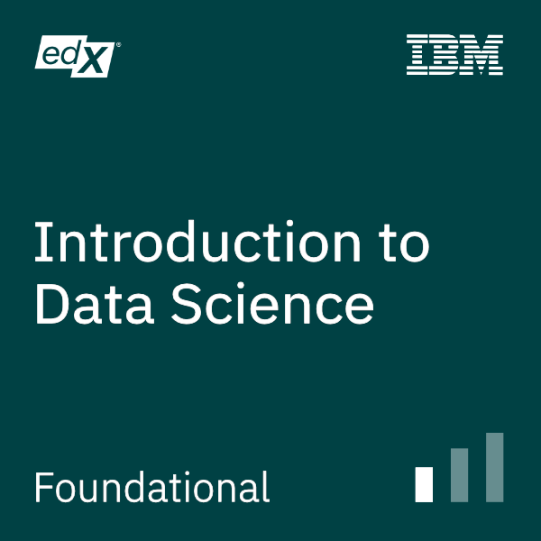

- 👋 Hi, I’m @KnowBetterCloud (James Radtke)
- 👀 I’m interested in ... Hybrid Cloud, Containers, Global Thermonuclear War 
- 🌱 I’m currently learning ... Banjo and Bass
- 💞️ I’m looking to collaborate on ...
- 📫 How to reach me ... 

- This is not a training program or curriculum.   There are many other folks already doing a great job at that.

| Service / Username       | URL |
|:-------------------------|:----------------------------------------|
| YouTube @knowbettercloud | https://www.youtube.com/@knowbettercloud
| Twitter @KnowBetterCloud | https://twitter.com/KnowBetterCloud 
| GitHub - KnowBetterCloud | https://github.com/knowbettercloud 
| Twitch - KnowBetterCloud | https://www.twitch.tv/knowbettercloud 
| Medium @knowbettercloud  | https://medium.com/@knowbettercloud/ 

<!---
KnowBetterCloud/KnowBetterCloud is a ✨ special ✨ repository because its `README.md` (this file) appears on your GitHub profile.
You can click the Preview link to take a look at your changes.
--->
