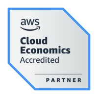

- 👋 Hi, I’m @KnowBetterCloud (James Radtke)
- 👀 I’m interested in ... Hybrid Cloud, Containers, Global Thermonuclear War 
- 🌱 I’m currently learning ... Banjo and Bass
- 💞️ I’m looking to collaborate on ... "how-to content", podcasts, etc...
- 📫 How to reach me ... knowbettercloud \<at> gmail

- What this is not: a training program or curriculum.   There are many other folks already doing a great job at that.

| Service / Username       | URL |
|:-------------------------|:-----------------------------------------|
| GitHub - KnowBetterCloud | https://github.com/knowbettercloud       | 
| Medium @knowbettercloud  | https://medium.com/@knowbettercloud/     |
| Twitch - KnowBetterCloud | https://www.twitch.tv/knowbettercloud    |
| YouTube @knowbettercloud | https://www.youtube.com/@knowbettercloud |
| Twitter @KnowBetterCloud | https://twitter.com/KnowBetterCloud      |
| Credly - knowbettercloud | https://credly.com/users/knowbettercloud |

# Best Practices
* Do NOT use the "Root Account" for anything other than creating new IAM accounts.
* Use MFA.  Always. (where possible)
* Cloud9 is a great IDE which is integrated to AWS Services and does not require management of AWS access keys.
* Create and use a ["tagging strategy"](https://docs.aws.amazon.com/general/latest/gr/aws_tagging.html) of some sort.

<!---
KnowBetterCloud/KnowBetterCloud is a ✨ special ✨ repository because its `README.md` (this file) appears on your GitHub profile.
You can click the Preview link to take a look at your changes.
--->
